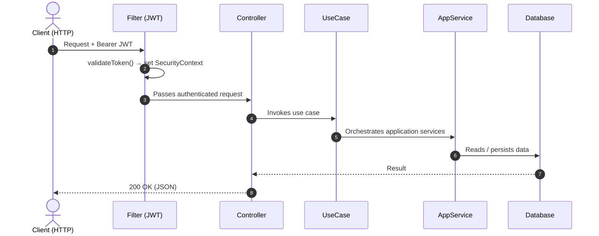

<div align="right">
  <a href="https://github.com/Etec-da-Zona-Leste-TCCs-DS-Noite/Conecta/blob/main/README.md">Portuguese 🇧🇷</a>
</div>

<div align="center">


### School Communication Platform

*Connecting students, teachers and staff in one place*

[](https://conectamais.duckdns.org)
[](https://conectamais.duckdns.org)
[](https://conectamais.duckdns.org)

</div>

---

## 📌 What is Conecta?

**Conecta** is a web platform built to eliminate communication barriers within the school environment. In many schools, the exchange of information between students, teachers and administrative staff is still fragmented — lost messages, difficulty accessing announcements, and no direct organized channel.

Conecta solves this by offering a **centralized hub** where:

- **Students** receive announcements and can send messages directly to the office or teachers
- **Teachers** receive announcements and can send messages directly to students in their classes
- **The office** manages users, classes, FAQs and has full visibility of all communication

All of this is accessible via web, with secure authentication, push notifications, media file support and a smooth experience on both desktop and mobile.

---

## 🔗 Access

> 🌐 **[https://conectamais.duckdns.org](https://conectamais.duckdns.org)**
>
> Production environment hosted on **Microsoft Azure**.

---

## 🧩 Core Features

| Module | Description |
|---|---|
| 💬 **Messages** | Direct chat between students and office/teachers |
| 📢 **Announcements** | Communications segmented by class or school-wide |
| ❓ **FAQ** | Frequently asked questions managed by the office |
| 👤 **User Management** | Registration and administration of students, teachers and staff |
| 🏫 **Classes** | Organization of students by class for targeted communication |
| 📎 **Media** | Upload and sharing of files and documents |
| 🔔 **Push Notifications** | Real-time alerts via Web Push (VAPID) |
| 🔐 **JWT Authentication** | Secure login with tokens |

---

## 🛠️ Tech Stack

### Backend
<p>
  
  
  
</p>

### Frontend
<p>
  
  
  
</p>

### Data
<p>
  
  
  
</p>

### Infrastructure
<p>
  
  
  
  
</p>

---

## 🏛️ Architecture

Conecta was designed with a focus on **separation of concerns**, **testability** and **code longevity**. The main architectural decisions adopted:

### Clean Architecture + Hexagonal (Ports & Adapters)

```
┌─────────────────────────────────────────────────────────────┐
│                     Application Layer                       │
│         Use Cases │ DTOs │ Mappers │ App Services           │
├─────────────────────────────────────────────────────────────┤
│                       Domain Layer                          │
│      Entities │ Value Objects │ Pure Business Rules         │
├─────────────────────────────────────────────────────────────┤
│                    Infrastructure Layer                     │
│  ┌─────────────────────────────────────────────────────┐    │
│  │                     Adapters                        │    │
│  │  REST Controllers │ Spring Data Repositories        │    │
│  └─────────────────────────────────────────────────────┘    │
│    PostgreSQL │ MongoDB │ Redis │ SMTP │ Web Push (VAPID)   │
└─────────────────────────────────────────────────────────────┘
```

- **Domain** — pure school domain entities (`User`, `Class`, `Message`, `Statement`, `FAQ`). Zero framework dependencies.
- **Application** — use cases orchestrate data flow between domain and adapters.
- **Infrastructure** — contains the concrete adapters (REST controllers, Spring Data repositories) and technical configurations for database, SMTP, push and SSL. It is the only layer that depends on frameworks and external technologies.

### DDD (Domain-Driven Design)

The domain model reflects the ubiquitous language of the school environment. Aggregates, entities and domain services are named and organized according to the real concepts of the problem (classes, announcements, messages, office).

### Why these choices?

- Isolating business rules makes unit testing easier without spinning up containers or databases
- Swapping databases or frameworks has zero impact on the domain
- Security review and error handling concentrated in the adapters

---

## 🔄 Request Flow



---

## ✅ Quality & Testing

The application and domain layer of the Java API has automated test coverage (unit and integration):

```
Test Coverage — Java API

  Domain          ████████████████████  96%   Entities, ValueObjects, Exceptions
  Application     ████████████████████  91%   UseCases, Services, DTOs, Mappers
  Infra/Adapters  █████████████░░░░░░░  62%   Controllers, Persistence, Gateways
  Infra/Security  ████████████░░░░░░░░  55%   Filter, Service, Models
  ──────────────────────────────────────────
  Total           ███████████████░░░░░  75%
```

---

## ⚙️ CI/CD

The **GitHub Actions** pipeline covers three stages:

```
push → main
        │
        ├─► backend-test      ← mvn test (JDK 21)
        ├─► frontend-build    ← npm build --production
        │
        └─► build-and-push    ← Docker Hub (henriquearthur/conecta-*)
                │
                └─► deploy    ← SSH → Azure VM
                              └─► docker compose pull && up -d
```

Secrets used in CI: `DOCKERHUB_TOKEN`, `AZURE_VM_IP`, `AZURE_VM_USER`, `AZURE_SSH_KEY`.

---

## 🗂️ Repository Structure

```
Conecta/
├── api/                          # Java Backend (Spring Boot + Maven)
│   ├── src/main/java/
│   │   ├── domain/               # Entities and business rules
│   │   ├── application/          # Use cases, DTOs, mappers
│   │   └── infrastructure/       # Adapters (controllers, repos) + db, SMTP, push config
│   └── src/test/java/            # Unit and integration tests
│
├── ui/
|   ├── src/app/
│   |    ├── core/                         # Guards, interceptors, models, global services
│   |    ├── features/                     # One module per feature (auth, chat, announcements, management…)
│   |    └── shared/components/            # Reusable components across features
|   └── environments/                      # Production and test URLs
│
├── compose.yaml                  # Docker orchestration (all services)
├── nginx.conf                    # Reverse proxy + SSL (Let's Encrypt)
├── prometheus.yml                # Observability / metrics
└── .github/workflows/cicd.yml    # CI/CD pipeline (GitHub Actions)
```

---

## 🐳 Docker Infrastructure

The `compose.yaml` orchestrates six services on an internal bridge network:

| Service | Image | Role |
|---|---|---|
| `nginx` | `nginx:latest` | Reverse proxy, SSL termination, media serving |
| `ui` | `henriquearthur/conecta-ui` | Angular frontend |
| `api` | `henriquearthur/conecta-api` | Spring Boot backend |
| `postgres` | `postgres:latest` | Relational data (users and classes) |
| `mongodb` | `mongo:latest` | Non-relational data (FAQs, messages and announcements) |
| `redis` | `redis:latest` | Cache |

---

## 🔒 Security

- 100% traffic via **HTTPS** with **Let's Encrypt** certificates (automatic renewal)
- Authentication via **JWT** + validation on every request by the `SecurityFilter`
- Sensitive data managed via environment variables (`.env` — never versioned)
- HTTPS headers correctly propagated via `X-Forwarded-*` in Nginx

Required sensitive variables (configure in `.env` or CI secrets):

```
ENCRYPTOR_KEY, JWT_SECRET
MAIL_USERNAME, MAIL_PASSWORD
VAPID_PUBLIC_KEY, VAPID_PRIVATE_KEY, VAPID_SUBJECT
IP
```

---

## 🚀 Running Locally

```bash
# Clone and enter the folder
git clone https://github.com/Etec-da-Zona-Leste-TCCs-DS-Noite/Conecta.git && cd Conecta

# Configure .env with the variables above
cp .env.example .env

# Start all services
docker compose up -d --build
```

Access at `http://localhost` (Nginx redirects to HTTPS in production).

---

## 📍 Next Steps

- [ ] Practical testing

---

<div align="center">

Developed as a TCC project — **Etec da Zona Leste** 🎓

</div>