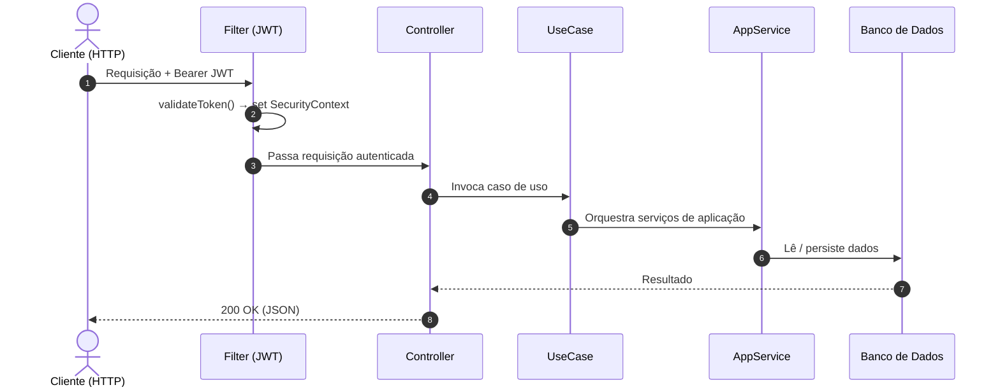

<div align="right">
  <a href="https://github.com/Etec-da-Zona-Leste-TCCs-DS-Noite/Conecta/blob/main/README.en.md">English</a>
</div>

<div align="center">


### Plataforma de Comunicação Escolar

*Unindo alunos, professores e secretaria em um só lugar*

[](https://conectamais.duckdns.org)
[](https://conectamais.duckdns.org)
[](https://conectamais.duckdns.org)

</div>

---

## 📌 O que é o Conecta?

**Conecta** é uma plataforma web criada para eliminar as barreiras de comunicação dentro do ambiente escolar. Em muitas escolas, a troca de informações entre alunos, professores e secretaria ainda é fragmentada — recados perdidos, dificuldade para acessar comunicados, ausência de um canal direto e organizado.

O Conecta resolve isso oferecendo um **hub centralizado** onde:

- **Alunos** recebem anúncios, comunicados e podem enviar mensagens diretamente à secretaria ou professores
- **Professores** recebem anúncios e conseguem enviar mensagens diretamente aos alunos de suas respectivas turmas
- **A secretaria** gerencia usuários, turmas, anúncios, FAQs e tem visibilidade total da comunicação

Tudo isso acessível via web, com autenticação segura, notificações push, suporte a arquivos de mídia e uma experiência fluida tanto no desktop quanto no mobile.

---

## 🔗 Acesso

> 🌐 **[https://conectamais.duckdns.org](https://conectamais.duckdns.org)**
>
> Ambiente em produção hospedado na **Microsoft Azure**.

---

## 🧩 Funcionalidades principais

| Módulo | Descrição |
|---|---|
| 💬 **Mensagens** | Chat direto entre alunos e secretaria/professores |
| 📢 **Anúncios** | Comunicados segmentados por turma ou para toda a escola |
| ❓ **FAQ** | Perguntas frequentes gerenciadas pela secretaria |
| 👤 **Gestão de Usuários** | Cadastro e administração de alunos, professores e funcionários |
| 🏫 **Turmas** | Organização de alunos por turma para comunicação direcionada |
| 📎 **Mídia** | Upload e compartilhamento de arquivos e documentos |
| 🔔 **Notificações Push** | Alertas em tempo real via Web Push (VAPID) |
| 🔐 **Autenticação JWT** | Login seguro com tokens |

---

## 🛠️ Stack Tecnológica

### Backend
<p>
  
  
  
</p>

### Frontend
<p>
  
  
  
</p>

### Dados
<p>
  
  
  
</p>

### Infraestrutura
<p>
  
  
  
  
</p>

---

## 🏛️ Arquitetura

O Conecta foi projetado com foco em **separação de responsabilidades**, **testabilidade** e **longevidade do código**. As principais decisões arquiteturais adotadas:

### Clean Architecture + Hexagonal (Ports & Adapters)

```
┌─────────────────────────────────────────────────────────────┐
│                     Application Layer                       │
│         Casos de Uso │ DTOs │ Mappers │ App Services        │
├─────────────────────────────────────────────────────────────┤
│                       Domain Layer                          │
│      Entidades │ Value Objects │ Regras de Negócio Puras    │
├─────────────────────────────────────────────────────────────┤
│                    Infrastructure Layer                     │
│  ┌─────────────────────────────────────────────────────┐    │
│  │                     Adapters                        │    │
│  │  Controllers REST │ Repositórios Spring Data        │    │
│  └─────────────────────────────────────────────────────┘    │
│    PostgreSQL │ MongoDB │ Redis │ SMTP │ Web Push (VAPID)   │
└─────────────────────────────────────────────────────────────┘
```

- **Domain** — entidades puras do domínio escolar (`Usuário`, `Turma`, `Mensagem`, `Statement`, `FAQ`). Zero dependência de frameworks.
- **Application** — casos de uso orquestram o fluxo de dados entre domínio e adaptadores.
- **Infrastructure** — contém os adaptadores concretos (controllers REST, repositórios Spring Data) e as configurações técnicas de banco, SMTP, push e SSL. É a única camada que depende de frameworks e tecnologias externas.

### DDD (Domain-Driven Design)

O modelo de domínio reflete a linguagem ubíqua do ambiente escolar. Agregados, entidades e serviços de domínio são nomeados e organizados segundo os conceitos reais do problema (turmas, anúncios, mensagens, secretaria).

### Por que essas escolhas?

- Isolar regras de negócio facilita testes unitários sem subir container ou banco
- Trocar banco de dados ou framework tem impacto zero no domínio
- Revisão de segurança e tratamento de erros concentrados nos adaptadores

---

## 🔄 Fluxo de uma requisição



---

## ✅ Qualidade & Testes

A camada de aplicação e domínio da API Java possui cobertura de testes automatizados (unitários e de integração):

```
Cobertura de Testes — API Java

  Domain          ████████████████████  96%   Entities, ValueObjects, Exceptions
  Application     ████████████████████  91%   UseCases, Services, DTOs, Mappers
  Infra/Adapters  █████████████░░░░░░░  62%   Controllers, Persistence, Gateways
  Infra/Security  ████████████░░░░░░░░  55%   Filter, Service, Models
  ──────────────────────────────────────────
  Total           ███████████████░░░░░  75%
```

---

## ⚙️ CI/CD

O pipeline no **GitHub Actions** cobre três estágios:

```
push → main
        │
        ├─► backend-test      ← mvn test (JDK 21)
        ├─► frontend-build    ← npm build --production
        │
        └─► build-and-push    ← Docker Hub (henriquearthur/conecta-*)
                │
                └─► deploy    ← SSH → Azure VM
                              └─► docker compose pull && up -d
```

Segredos utilizados no CI: `DOCKERHUB_TOKEN`, `AZURE_VM_IP`, `AZURE_VM_USER`, `AZURE_SSH_KEY`.

---

## 🗂️ Estrutura do Repositório

```
Conecta/
├── api/                          # Backend Java (Spring Boot + Maven)
│   ├── src/main/java/
│   │   ├── domain/               # Entidades e regras de negócio
│   │   ├── application/          # Casos de uso, DTOs, mappers
│   │   └── infrastructure/       # Adapters (controllers, repos) + config de banco, SMTP, push
│   └── src/test/java/            # Testes unitários e de integração
│
├── ui/
|   ├── src/app/
│   |    ├── core/                         # Guards, interceptors, models, services globais
│   |    ├── features/                     # Um módulo por funcionalidade (auth, chat, anúncios, management…)
│   |    └── shared/components/            # Componentes reutilizáveis entre features
|   └── enviroments/                       # Urls de produção e de testes 
│
├── compose.yaml                  # Orquestração Docker (todos os serviços)
├── nginx.conf                    # Reverse proxy + SSL (Let's Encrypt)
├── prometheus.yml                # Observabilidade / métricas
└── .github/workflows/cicd.yml    # Pipeline CI/CD (GitHub Actions)
```

---

## 🐳 Infraestrutura Docker

O `compose.yaml` orquestra seis serviços em uma rede bridge interna:

| Serviço | Imagem | Função |
|---|---|---|
| `nginx` | `nginx:latest` | Reverse proxy, SSL termination, serving de mídia |
| `ui` | `henriquearthur/conecta-ui` | Frontend Angular |
| `api` | `henriquearthur/conecta-api` | Backend Spring Boot |
| `postgres` | `postgres:latest` | Dados relacionais (usuários e turmas) |
| `mongodb` | `mongo:latest` | Dados de não relacionais (FAQs, mensagens e anúncios) |
| `redis` | `redis:latest` | Cache |

---

## 🔒 Segurança

- Tráfego 100% via **HTTPS** com certificados **Let's Encrypt** (renovação automática)
- Autenticação via **JWT** + validação em todo request pelo `SecurityFilter`
- Dados sensíveis gerenciados via variáveis de ambiente (`.env` — nunca versionado)
- Headers HTTPS corretamente propagados via `X-Forwarded-*` no Nginx

Variáveis sensíveis necessárias (configurar em `.env` ou secrets do CI):

```
ENCRYPTOR_KEY, JWT_SECRET
MAIL_USERNAME, MAIL_PASSWORD
VAPID_PUBLIC_KEY, VAPID_PRIVATE_KEY, VAPID_SUBJECT
IP
```

---

## 🚀 Como rodar localmente

```bash
# Clone e entre na pasta
git clone https://github.com/Etec-da-Zona-Leste-TCCs-DS-Noite/Conecta.git && cd Conecta

# Configure o .env com as variáveis acima
cp .env.example .env

# Suba todos os serviços
docker compose up -d --build
```

Acesse em `http://localhost` (Nginx redireciona para HTTPS em produção).

---

## 📍 Próximos passos

- [ ] Realização de testes práticos
   
---

<div align="center">

Desenvolvido como projeto de TCC — **Etec da Zona Leste** 🎓

</div>